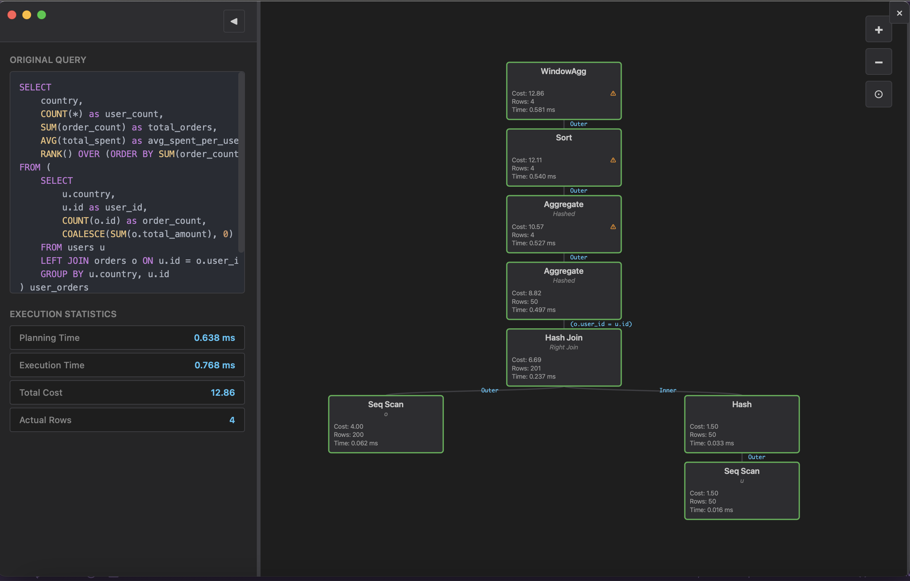
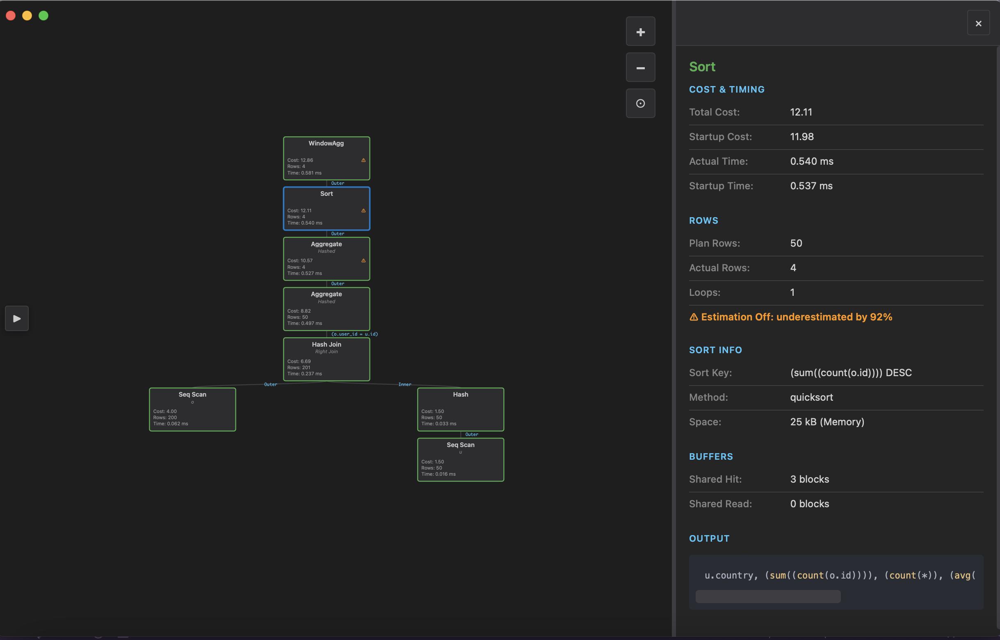
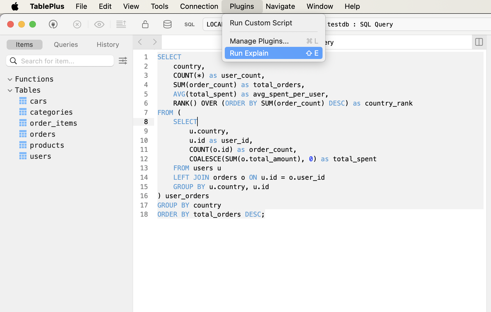

# PostgreSQL EXPLAIN Visualizer for TablePlus

A TablePlus plugin that visualizes PostgreSQL EXPLAIN query plans with an interactive D3.js tree diagram, making it easy to identify performance bottlenecks and optimization opportunities.

## Features

### Interactive Visualization

- **D3.js tree layout** showing the complete query execution plan hierarchy
- **Color-coded nodes** indicating cost levels (green/orange/red)
- **Interactive tooltips** with comprehensive performance metrics on hover
- **Join conditions displayed on edges** between nodes
- **Performance warnings** for estimation mismatches

### Detailed Metrics

Each node shows:

- **Node type** (Seq Scan, Hash Join, Aggregate, etc.)
- **Strategy/Join type** (Hashed, Right Join, etc.)
- **Cost estimates** vs actual costs
- **Row estimates** vs actual rows
- **Execution timing** in milliseconds
- **Memory usage** for sorts and aggregates
- **Buffer statistics** (cache hits vs disk reads)

### ⚠️ Performance Debugging

The visualizer highlights:

- **Expensive operations** (red nodes for high cost)
- **Estimation problems** (Flags nodes when planner estimates are off by >50%)
- **Seq scans** on large tables
- **Sort operations** with memory usage
- **Join conditions** and filter predicates
- **Cache effectiveness** (buffer hit rates)

## Installation

```bash
# Step 1: Clone the repo:
git clone git@github.com:Neilerino/TablePlus-Explain-Visualizer.git
# Step 2: Go into project directory:
cd TablePlus-Explain-Visualizer
# Step 3: Install packages
npm i
# Step 4: Build dist for the package
npm run build
# Step 5: Add to TablePlus
open PostgresExplain.tableplusplugin
```

### How It Works

1. Prepends `EXPLAIN (ANALYZE, COSTS, VERBOSE, BUFFERS, FORMAT JSON)` to your query
2. Executes the EXPLAIN query via TablePlus API
3. Parses the JSON output from PostgreSQL
4. Converts the plan tree to D3.js hierarchy format
5. Generates self-contained HTML with embedded visualization
6. Displays using TablePlus's HTML viewer

## Troubleshooting

### Plugin doesn't appear in menu

- Make sure you're connected to a **PostgreSQL** database (not MySQL, SQLite, etc.)
- Try restarting TablePlus
- Check that the plugin is installed in the correct directory

### "Invalid Query Type" error

- The plugin only works with `SELECT`, `INSERT`, `UPDATE`, `DELETE`, and `WITH` queries
- Remove any existing `EXPLAIN` from your query

### Visualization appears blank

- Ensure the query actually executed successfully (Query should appear with EXPLAIN ANALYZE ... in the TablePlus Query console).

## Contributing

Feel free to submit issues or pull requests for:

- Additional performance metrics to display
- Better visualization layouts
- Support for other database engines
- Bug fixes

## License

MIT License - feel free to modify and distribute

## Credits

- Built for [TablePlus](https://tableplus.com/)
- Visualization powered by [D3.js](https://d3js.org/)

## Screenshots






